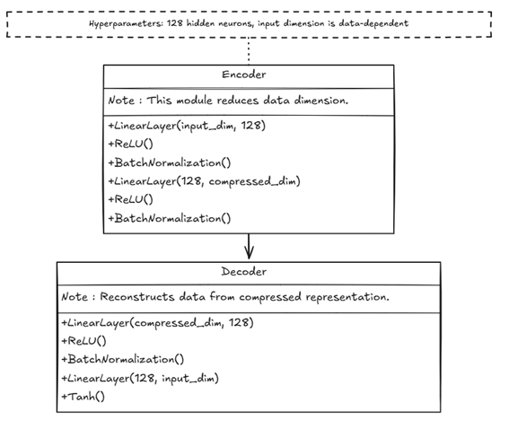
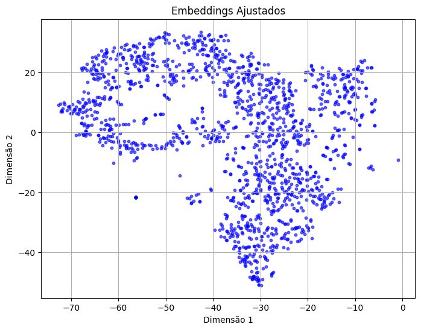
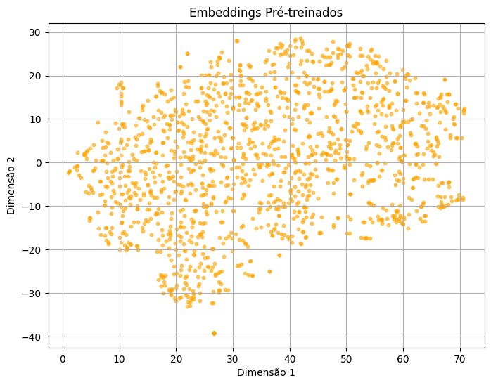

# News Recommendation

### Leitura pode ser feita a partir do [link](aps_2_nlp.pdf)

# Descrição do Conjunto de Dados
Para criar o conjunto de dados, dados de notícias foram coletados do site Poder360. Esses dados foram extraídos, armazenados e organizados no formato JSON. Posteriormente, os dados foram convertidos para um DataFrame e CSV, a fim de facilitar a análise.

# Processo de Geração de Embeddings
O processo de geração de embeddings foi realizado utilizando um autoencoder. A rede neural possui duas partes: um encoder e um decoder. O encoder consiste em duas camadas lineares com ativações ReLU e normalização em lote, reduzindo a dimensão dos dados. O decoder reconstrói os dados originais a partir de uma representação comprimida, utilizando a função de ativação Tanh na saída. Os hiperparâmetros incluem um tamanho de camada oculta de 128 neurônios e uma dimensão de entrada que varia conforme os dados.

# Processo de Treinamento
O processo de treinamento do autoencoder foi realizado utilizando uma função de perda de erro quadrático médio (MSE). Essa função de perda minimiza a diferença entre as embeddings originais e as reconstruídas. A escolha do MSE é adequada para garantir que as reconstruções se aproximem dos valores originais, facilitando a aprendizagem das características subjacentes dos dados. A função de perda é expressa como:

$$
MSE = \frac{1}{N} \sum_{i=1}^{N} (x_i - \hat{x}_i)^2
$$

onde $x_i$ representa o embedding original e $\hat{x}_i$ representa o embedding reconstruído.
 
# Visualização de Embeddings

A primeira figura apresenta os embeddings ajustados, que mostram uma organização clara e agrupamentos em diferentes regiões. Esse padrão indica que o modelo ajustado aprendeu características específicas dos dados, gerando representações mais distintas.

A segunda figura exibe os embeddings pré-treinados, cuja distribuição é menos segmentada e apresenta pontos mais dispersos. Essa configuração sugere que o modelo pré-treinado carece de informações suficientes para identificar padrões mais sutis, evidenciando a importância do fine-tuning para beneficiar a classificação ou clustering das amostras.

# Testes do Sistema de Busca
Testes foram realizados na pasta `test`. Pode-se usar o diretório raiz com o comando `pytest test/` ou testar as respectivas queries no link: [News Recommendation](https://newsrecomendationspart2-production.up.railway.app/docs#/default/query_route_query_get)

Exemplos de queries e seus retornos:

- Retorna 10 documentos: Query: "Elon Musk anuncia novo projeto de exploração espacial"
- Retorna menos que 10 e mais que 1 documento: Query: "Brasil vence a Copa do Mundo"
- Retorna 10 documentos (query não óbvia): Query: "crescimento verde"

# Atualização do Modelo com Novo Índice FAISS (MLOps - make it nicer!)
O endpoint `update_model` recebe uma URL (`model_url`), baixa o índice FAISS para um buffer de memória e substitui o índice atual para que consultas futuras usem o índice atualizado. Para usá-lo, armazene o novo índice em um local acessível, como um bucket S3, e envie uma solicitação POST para `/update_model` com a URL do índice.

# Referências
- Base de dados : [Poder360](https://www.poder360.com.br/)
- Vector database : [FAISS](https://github.com/facebookresearch/faiss)
- Embeddings Pré -treinados : [Hugging Face](https://huggingface.co/distilbert/distilgpt2)
